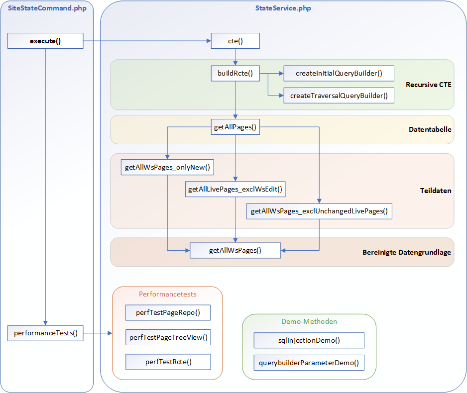
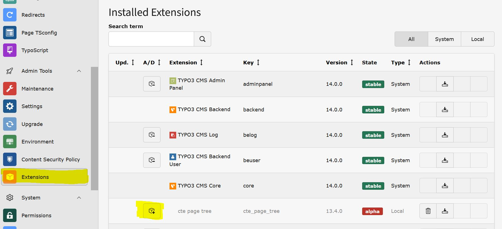
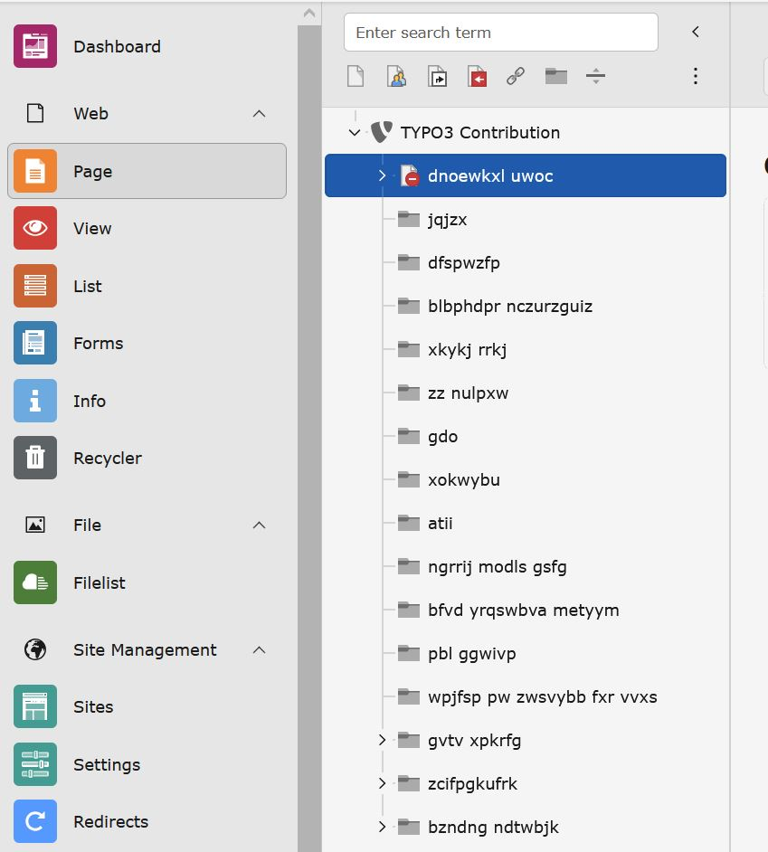
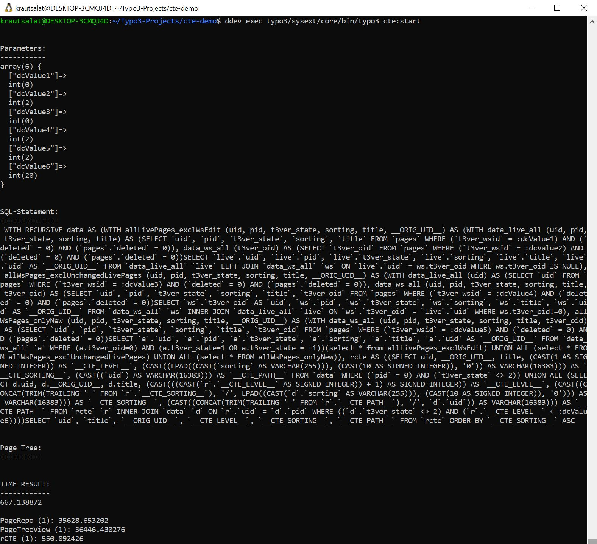
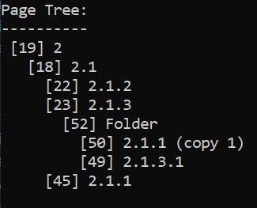
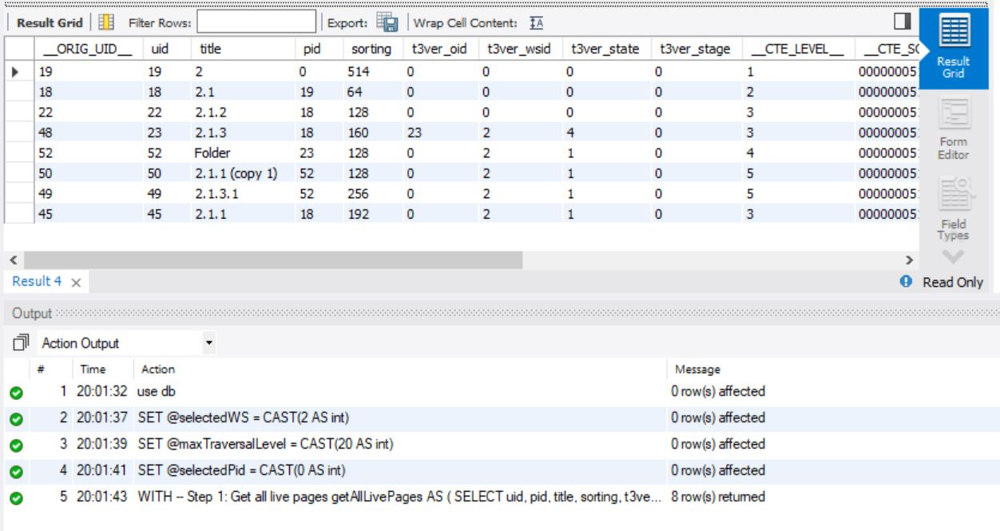
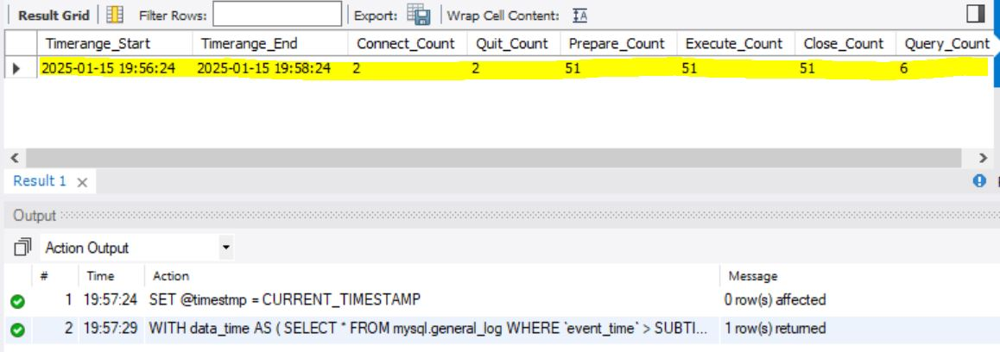

<a id="readme-top"></a>

<!-- TABLE OF CONTENTS -->

  # Table of Contents
  <ul>
    <li>
      <a href="#about-the-project">About The Project</a>
    </li>
    <li>
      <a href="#getting-started">Getting Started</a>
      <ul>
        <li><a href="#installation">Installation</a></li>
      </ul>
    </li>
    <li><a href="#usage">Usage</a></li>
    <li><a href="#customization">Customization</a></li>
    <li><a href="#bonus-features">Bonus features</a></li>
    <li><a href="#license">License</a></li>
    <li><a href="#contact">Contact</a></li>
  </ul>


<!-- ABOUT THE PROJECT -->
## About The Project
This repository demonstrates the usage of a recursive cte within TYPO3.
It's based on TYPO3 v13.4 and the <a href="https://github.com/sbuerk/tf-basics-extension">tf-basics-extension</a>.

The recursive cte is created with Doctrine DBAL and TYPO3's own implementation of the "WITH RECURSIVE" statement. It creates the TYPO3 page tree array with a single SQL statement.

Features:
* Generating the TYPO3 page tree for a given workspace
* Output fields can/must be passed as parameters
* Comparing execution time of recursive cte vs. non recursive
* Two methods demonstrating SQL injections and handling parameters for nested Query Builder instances

<div align="center">
	
</div>
<br>
Disclaimer:<br>
Recursive cte's are NOT yet implemented in the official Doctrine DBAL project and are currently exclusive to TYPO3 v13.4.
While being so, the implementation of the "WITH RECURSIVE" statement could change in future TYPO3 releases.
This repository should not be used for production as it is.

<p align="right">(<a href="#readme-top">back to top</a>)</p>


<!-- GETTING STARTED -->
## Getting started

To get this repo working you need a working TYPO3 v13.4 instance and an extension with a service.
You can either use an existing TYPO3 instance or a core-contribution (see <a href="#installation">Installation</a>).


### Installation

I recommend using the official TYPO3 documentation for installing a <a href="https://docs.typo3.org/m/typo3/guide-contributionworkflow/main/en-us/Appendix/SettingUpTypo3Ddev.html#setting-up-typo3-with-ddev">core-contribution</a> as this will be updated frequently.

You can use the installation steps below, which are mostly the same (tested on Jan, 15th 2025).<br>
For the installation you will need:
* Windows System with WSL
* Docker
* DDEV
* Git

#### TYPO3 core-contribution
1. Create a project directory
   ```
   mkdir cte-demo
   ```
   ```
   cd cte-demo/
   ```
2. Clone the TYPO3 repository
   ```
   git clone https://github.com/typo3/typo3.git .
   ```
3. Configure and start the DDEV environment
   ```
   ddev config \
    --project-name 'CTE-Demo' \
    --project-type 'typo3' \
    --docroot '.' \
    --database 'mariadb:10.11' \
    --php-version '8.2' \
    --composer-version 'stable' \
    --nodejs-version '22' \
    --project-tld 'ddev.site' \
    --router-http-port '80' \
    --router-https-port '443' \
    --webserver-type 'apache-fpm' \
    --additional-hostnames 'cte-demo-dev.ddev.site,cte-demo-prod.ddev.site' \
    --timezone 'Europe/Berlin' \
    --web-environment='TYPO3_CONTEXT=Development' \
    --webimage-extra-packages='build-essential'
   ```
   ```
   ddev start
   ```
   ```
   ./Build/Scripts/runTests.sh -s composerInstall
   ```

4. Configure and start TYPO3
   ```
   ddev exec touch FIRST_INSTALL
   ```
    ```
    ddev typo3 setup \
    --driver=mysqli \
    --host=db \
    --port=3306 \
    --dbname=db \
    --username=db \
    --password=db \
    --admin-username=admin \
    --admin-user-password='typo3Admin!' \
    --admin-email="admin@example.com" \
    --project-name='TYPO3 Contribution' \
    --no-interaction \
    --server-type=apache \
    --force
    ```
    ```
    ddev launch typo3
    ```
    Credentials for the Backend<br>
     User: admin  <br>
     Password: typo3Admin!
    
#### Extension
1. Create extension directory
   ```
   mkdir typo3conf/ext/cte_page_tree
   ```
   
2. Clone repos
   ```
   git clone https://github.com/sbuerk/tf-basics-extension.git typo3conf/ext/cte_page_tree/
   ```
   ```
   git clone https://github.com/ASchoenfeld-BHT/TYPO3_recursive_cte.git
   ```
   
3. Override relevant files from the tf-basics-extension
   ```
   cp -rf TYPO3_recursive_cte/Extension/typo3conf/ext/cte_page_tree/ typo3conf/ext/
   ```
   
4. Install extension via the TYPO3 backend, in the extensions module:


#### Test data (not necessary if you create your own page tree)
1. Import test data to get a huge page tree
   ```
   ddev import-db -f TYPO3_recursive_cte/Testdata/pages.sql --no-drop --no-progress
   ```


<p align="right">(<a href="#readme-top">back to top</a>)</p>


<!-- USAGE EXAMPLES -->
## Usage

To use the service of the extension you need to call it via command line:
```
ddev exec typo3/sysext/core/bin/typo3 cte:start
```

This will output you:
* The parameters of the Query Builder object
* The (prepared) SQL statement with it's variables (i.e. :dcValue1)
* The time taken to get the page tree
* One loop of a comparing performancetest with the services recursive cte vs. PageRepository->getPageIdsRecursive() vs. PageTreeView->getTree()



### Customization
#### You can display the page tree in the output by uncommenting these lines in method "cte()" in StateService.php:
```
echo "\n\nPage Tree:\n----------\n";
//foreach ($rcteOutput as $page) {
//    echo str_repeat("  ",$page['__CTE_LEVEL__'] -1) . ' [' . $page['uid'] . '] ' . $page['title'] . "\n";
//}
```


#### To get more/other fields from the "pages" table, edit the variable $fields_selective in "cte()", in StateService.php:
```
$fields_selective = ['uid', 'title'];
```

#### To customize the performance tests use the variables in method "execute()" in SiteStateCommand.php:
```
// ____Performance test part____
// Performance testing parameters
$times=1;           // Number of executions (to get a more consitent value)
$pageRepo=true;     // Set to false, to disable performance test for PageRepository
$pageTreeView=true; // Set to false, to disable performance test for PageTreeView
$rCte=true;         // Set to false, to disable performance test for recursive cte
```


### Bonus features

#### Recursive cte as plain SQL
You can use the SQL-Scripts/rCTE_v1.4.sql to execute the plain recursive SQL statement for your database. If you followed my installation guide the credentials will be db:db or root:root.
Make sure u select the correct DB (use db;) and set these three parameters before you start:
```
SET @selectedWS = CAST(0 AS int);
SET @maxTraversalLevel = CAST(20 AS int);
SET @selectedPid = CAST(0 AS int);
```


#### DB analysis
For a detailed look into the database you can use SQL-Scripts/Performancemessung_v1.1.sql. It will give you a good overview of the number of statements received by the database.
To use it, you have to execute this line befor or after you call the extension:
```
SET @timestmp = CURRENT_TIMESTAMP;
```
By default you will get all statements +-1min  from this timestamp. You can change this by editing "SUBTIME(@timestmp, "0:1:0")" in the "data_time" cte:
```
WITH
	data_time AS (
		SELECT * FROM mysql.general_log WHERE `event_time` > SUBTIME(@timestmp, "0:1:0") AND `event_time` < SUBTIME(@timestmp, "-0:1:0")
	),
...
```


You will also find additional, usefull commands in this .sql-file.

#### Prepared statements and SQL injections
In the StateService.php you find the methods "sqlInjectionDemo()" and "querybuilderParameterDemo()". These will show you the importance of prepared statements. You can fiddle around with them in the "execute()" method in SiteStateCommand.php:
```
// ____Demo part____
// Only for demo purposes - not relevant for recursive cte
// $this->stateService->sqlInjectionDemo();
// $this->stateService->querybuilderParameterDemo();
```


<p align="right">(<a href="#readme-top">back to top</a>)</p>


<!-- LICENSE -->
## License
This is an experimental project to demonstrate the usage of recursive cte's with the Doctrine DBAL Query Bilder. Feel free to use it for your projects :) 

<p align="right">(<a href="#readme-top">back to top</a>)</p>


<!-- CONTACT -->
## Contact

A. Schoenfeld - s80423@bht-berlin.de

Project Link: [https://github.com/ASchoenfeld-BHT/TYPO3_recursive_cte](https://github.com/ASchoenfeld-BHT/TYPO3_recursive_cte)

<p align="right">(<a href="#readme-top">back to top</a>)</p>
